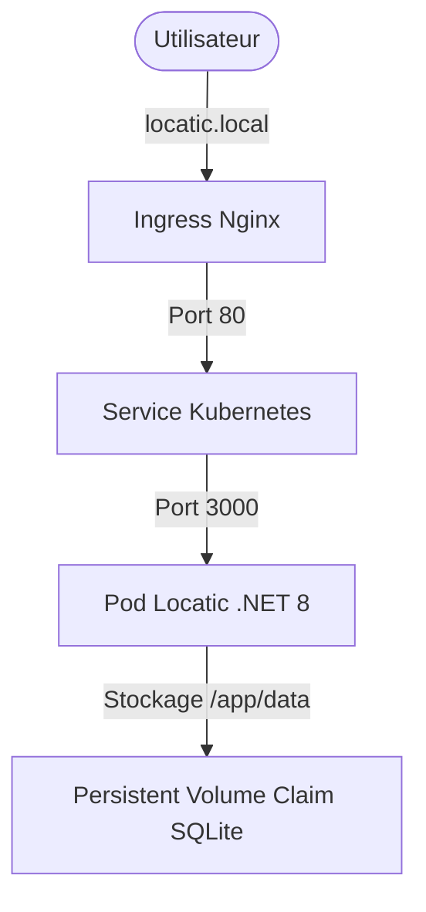

# Projet Locatic

## Architecture Globale 

### Schéma de l'architecture


### Terraform
Terraform automatise le provisionnement et la gestion de l'infrastructure. Il crée le namespace locatic-infra et le stockage persistant (PersistentVolumeClaim) pour que SQLite ne perde pas ses données, et la configuration globale (ConfigMap).

### Passerelle Terraform ➡️ Ansible
Ansible récupère dynamiquement le nom du namespace créé par Terraform grâce à la commande ```terraform output```.

### Ansible 
Ansible s'occupe du déploiement applicatif (le contenu). Il prend les templates Jinja2 (```app-deployment.yml.j2``` et ```app-ingress.yml.j2```), les configure avec les variables et les applique sur le cluster.

### Reverse Proxy Nginx
Grâce à Nginx, l'utilisateur ne tape pas directement sur l'application .NET. Il passe par un Ingress Controller (Nginx) qui agit comme un Reverse Proxy, gère le nom de domaine ```locatic.local``` sur le port ```80```, puis redirige le trafic vers le service de Locatic.

### SQLite 
L'application utilise une base SQLite stockée sur un volume persistant (```/app/data```), lié au PVC créé par Terraform. Ainsi, même si les pods de l'application redémarrent, aucune donnée n'est perdue.

## Le déploiement local 
### Pré-requis 
- Minikube installé et démarré (```minikube start```)
- Addon Ingress activé sur Minikube (```minikube addons enable ingress```)
- Terraform (>= 1.6) et Ansible installés localement.

### Commandes à lancer 
Initialiser et appliquer Terraform
- Se placer dans le dossier /terraform, initialiser et appliquer Terraform
```bash
cd infra/terraform
terraform init
terraform apply -auto-approve
```

Lancer le playbook Ansible 
```bash
cd ../..
cd infra/ansible
ansible-playbook -i inventory.yml site.yml
```

Récupérer l'ip du Minikube 
- ```minikube ip```
- Copier l'IP 
- Ajouter ceci au fichier ```/etc/hosts``` avec la commande ```sudo nano /etc/hosts```
- Coller "ip copiée" locatic.local
Cela devrait ressembler à ```155.165.49.2 locatic.local```
- Sauvegarder et quitter (Ctrl+O, Entrée, puis Ctrl+X).
- Valider et se rendre sur http://locatic.local

## Procédures de validation & tests

### Validation de l'application
On va vérifier que tout est en ligne avec la commande ```kubectl get all -n locatic-infra```
Vous devriez pouvoir ouvrir votre navigateur sur http://locatic.local

### Test de résilience 
- Se connecter à l'application 
- Ajouter une donnée 
- Simuler un crash en supprimant le pod avec la commande ```kubectl delete pod -l app=locatic-app -n locatic-infra``
- Attendre que le pod soit en Running ```kubectl get pods -n locatic-infra```
- On constate normalement que Kubernetes recrée instantanément un nouveau pod 
- On rafraîchit la page http://locatic.local et la donnée est toujours là.

## Pipeline CI/CD et Sécurité 
### Workflow Git 
Mise en place d'un pipeline d'intégration continue via Github Actions avec vérifications des tests, de la sécurité puis du build déclenché à chaque Pull Request vers ```main```

On enchaîne les étapes logiquement. 
- D'abord les *tests* pour s'assurer que le code fonctionne et compile bien. 
- Ensuite la *sécurité*, en utilisant Trivy pour analyser le code et l'image Docker à la recherche de vulnérabilités 
- Le *build* pour générer et publier l'image Docker uniquement si les étapes précédentes sont validées