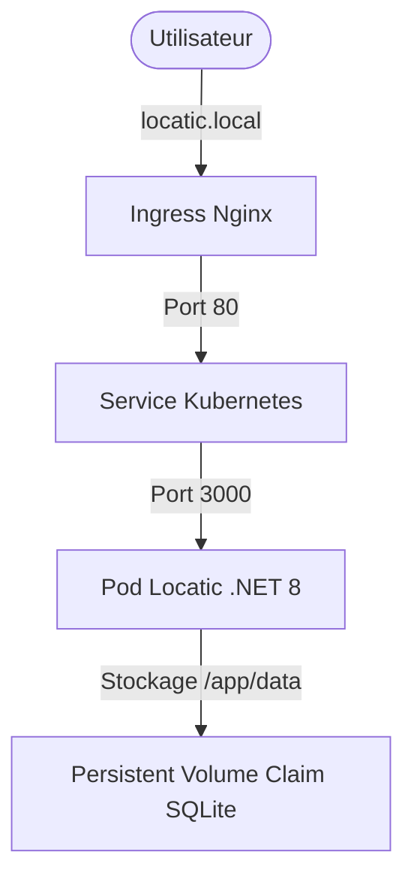

# Architecture Globale 

## Schéma de l'architecture



## Explications des choix

### Terraform
Terraform automatise le provisionnement et la gestion de l'infrastructure. Il crée le namespace locatic-infra et le stockage persistant (PersistentVolumeClaim) pour que SQLite ne perde pas ses données, et la configuration globale (ConfigMap).

### Passerelle Terraform ➡️ Ansible
Ansible récupère dynamiquement le nom du namespace créé par Terraform grâce à la commande ```terraform output```.

### Ansible 
Ansible s'occupe du déploiement applicatif (le contenu). Il prend les templates Jinja2 (```app-deployment.yml.j2``` et ```app-ingress.yml.j2```), les configure avec les variables et les applique sur le cluster.

### Reverse Proxy Nginx
Grâce à Nginx, l'utilisateur ne tape pas directement sur l'application .NET. Il passe par un Ingress Controller (Nginx) qui agit comme un Reverse Proxy, gère le nom de domaine ```locatic.local``` sur le port ```80```, puis redirige le trafic vers le service de Locatic.

### SQLite 
L'application utilise une base SQLite stockée sur un volume persistant (```/app/data```), lié au PVC créé par Terraform. Ainsi, même si les pods de l'application redémarrent, aucune donnée n'est perdue.