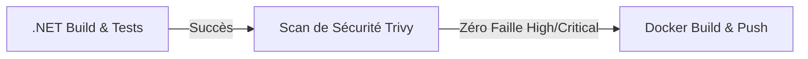

# Pipeline CI/CD et Sécurité 
## Workflow Git 
Protection de la branche ```main``` grâce à la mise en place d'un pipeline d'intégration continue via Github Actions avec vérifications des tests, de la sécurité puis du build déclenché à chaque Pull Request vers ```main```

On enchaîne les étapes logiquement pour optimiser les ressources et le temps de calcul.
- D'abord les *tests* pour s'assurer que le code fonctionne et compile bien. 
- Ensuite la *sécurité*, en utilisant Trivy pour analyser le code et l'image Docker à la recherche de vulnérabilités 
- Le *build* pour générer et publier l'image Docker uniquement si les étapes précédentes sont validées



## Résolution d'une faille
Quand la PR#5 a été faite, le job de sécurité a échoué avec un ```exit code 1```, bloquant la validation de l'image.

Trivy a détecté une faille de sévérité HIGH. 
J'ai donc mis à jour les bibliothèques de persistance d'Entity Framework Core vers la version stable 8.0.4.